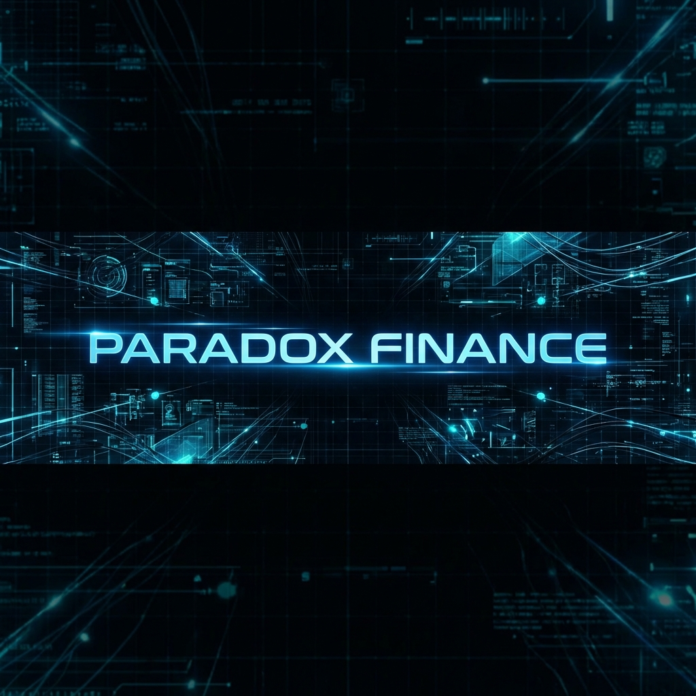

<div align="center">
  
</div>

<div align="center">

# PARADOX FINANCE INTERFACE
### *Architect your Reality... with Paradox.*

[](https://github.com/i-am-paradox/paradox-finance-interface)
[](LICENSE)
[](releases)

</div>

---

## 🕵️‍♂️ Mission: Code Intelligence
**Paradox Finance Interface** isn't just a dashboard; it's a **Neuro-Linguistic Interface** for the decentralized economy. Built on the principles of **Sherlock Holmes' Deductive Method** and **Tony Stark's Engineering**, this system provides institutional-grade precision wrapped in a hyper-modern aesthetic.

> *"The world is full of obvious things which nobody by any chance ever observes."* - **Sherlock Holmes**

We observe everything.

---

## 🚀 Paradox Capabilities

<div align="center">

| **Automated Deduction** | **Quantum Connectivity** | **The Mind Palace** |
|:---:|:---:|:---:|
| ⚡ **Zero-Latency** <br> Algorithmic trading execution via `Sherlock_OS v221B`. | 🌐 **Stark Glass UI** <br> Holographic 3D visualization of liquidity depth. | 🔐 **Archive_V4** <br> Multi-sig governance signed by Sherlock himself. |

</div>

---

## 🛠️ The Tech Stack (Stark Protocol)

*   **Core:** `HTML5` + `ES6+` (Vanilla Speed, no bloat)
*   **Visuals:** `Tailwind CSS` (Utility-First Precision)
*   **Iconography:** `Iconify` (Solar & Lucide Sets)
*   **Optics:** Custom CSS Beams, Sonar Waves, and Neon Glows.

---

## 💻 Initialization Sequence

1.  **Clone the Source:**
    ```bash
    git clone https://github.com/i-am-paradox/paradox-finance-interface.git
    ```

2.  **Enter the System:**
    ```bash
    cd paradox-finance-interface
    # No npm install required. This is raw power.
    open index.html
    ```

---

## 📂 System Architecture

```bash
paradox-finance-interface/
├── index.html                # [CORE] The Neural Interface
├── paradox_banner.png        # [ASSET] Visual Identity
├── stark_badge.png           # [ASSET] Corporate Sponsorship
└── README.md                 # [DOCS] System Manual
```

---

## 👤 Engineered By

<div align="center">
  <h3>Paradox (Sherlock Holmes)</h3>
  <p><i>The game is always afoot.</i></p>
  <a href="https://github.com/i-am-paradox">
    
  </a>
</div>
